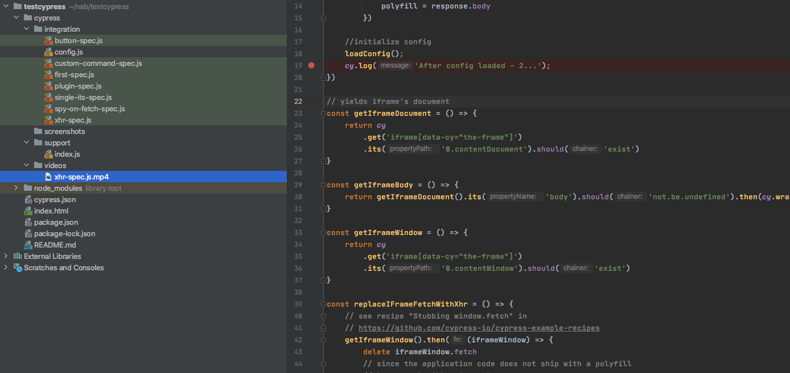

# Simple example with Cypress Test Framework

## install 
```npm i```

## run test
```npm run test:ci:chrome-xhr```

## run headless test
```test:ci:chrome-headless-xhr```

## recording location 
in headless mode, cypress records and create mp4 files 
```testcypress/cypress/videos/xhr-spec.js.mp4```


More Examples: https://github.com/cypress-io/cypress-example-recipes/tree/master/examples